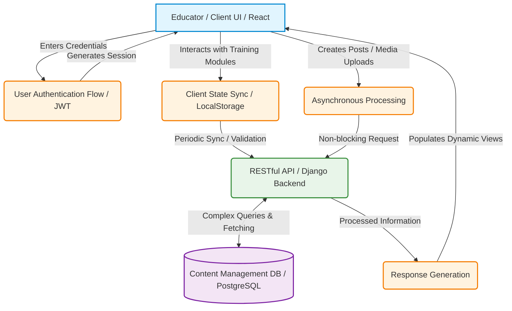

```mermaid
graph TD
    classDef default fill:#f9f9f9,stroke:#333,stroke-width:1px;
    classDef user fill:#e1f5fe,stroke:#0288d1,stroke-width:2px;
    classDef process fill:#fff3e0,stroke:#f57c00,stroke-width:2px;
    classDef backend fill:#e8f5e9,stroke:#388e3c,stroke-width:2px;
    classDef db fill:#f3e5f5,stroke:#7b1fa2,stroke-width:2px;

    User[Educator / Client UI / React]:::user

    Auth(User Authentication Flow / JWT):::process
    AsyncProcess(Asynchronous Processing):::process
    StateSync(Client State Sync / LocalStorage):::process
    BackendAPI(RESTful API / Django Backend):::backend
    ResponseGen(Response Generation):::process

    DB[(Content Management DB / PostgreSQL)]:::db

    User -->|Enters Credentials| Auth
    Auth -->|Generates Session| User
    
    User -->|Interacts with Training Modules| StateSync
    StateSync -->|Periodic Sync / Validation| BackendAPI
    
    User -->|Creates Posts / Media Uploads| AsyncProcess
    AsyncProcess -->|Non-blocking Request| BackendAPI
    
    BackendAPI <-->|Complex Queries & Fetching| DB
    
    BackendAPI -->|Processed Information| ResponseGen
    ResponseGen -->|Populates Dynamic Views| User
```
